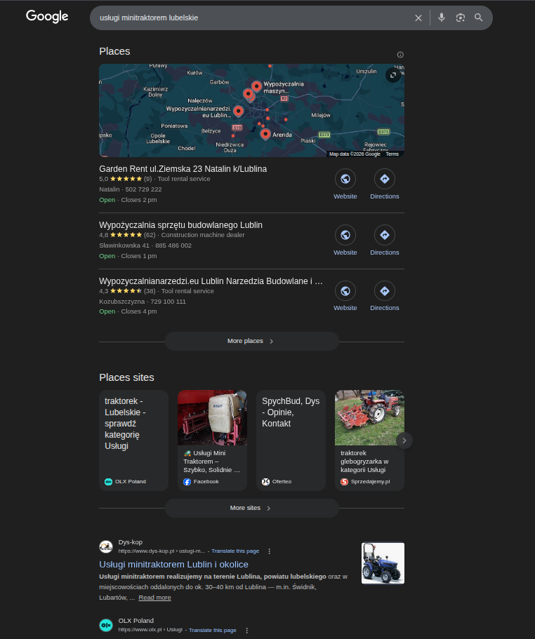
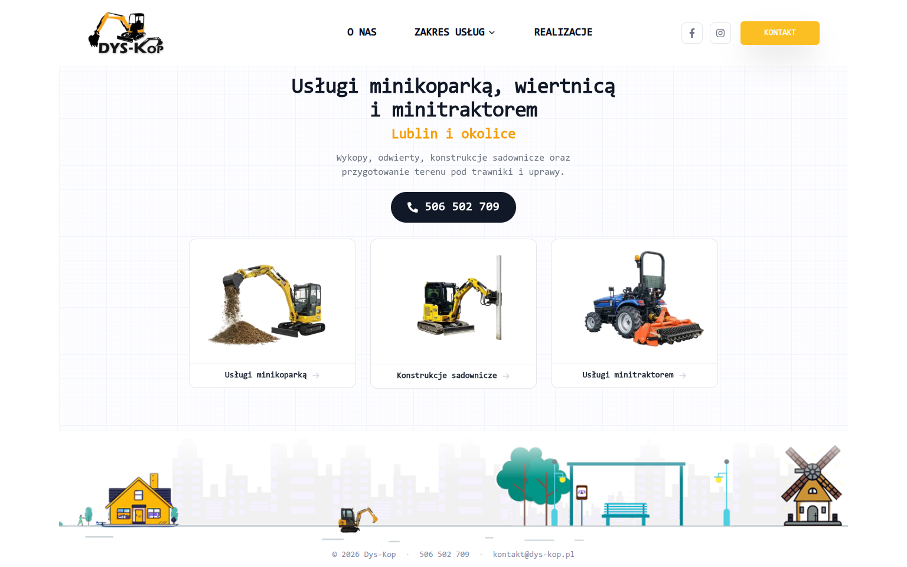
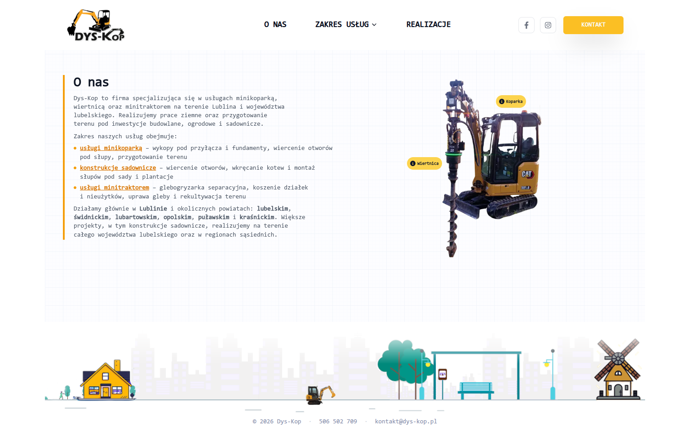
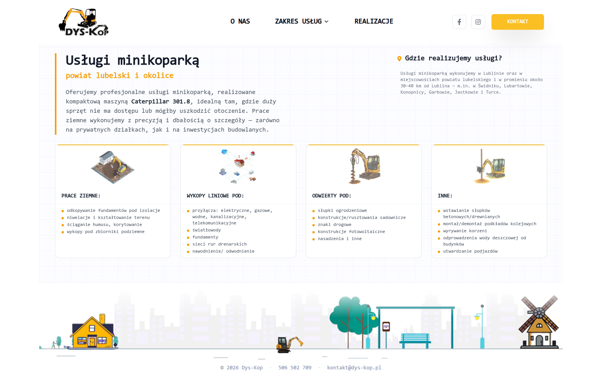
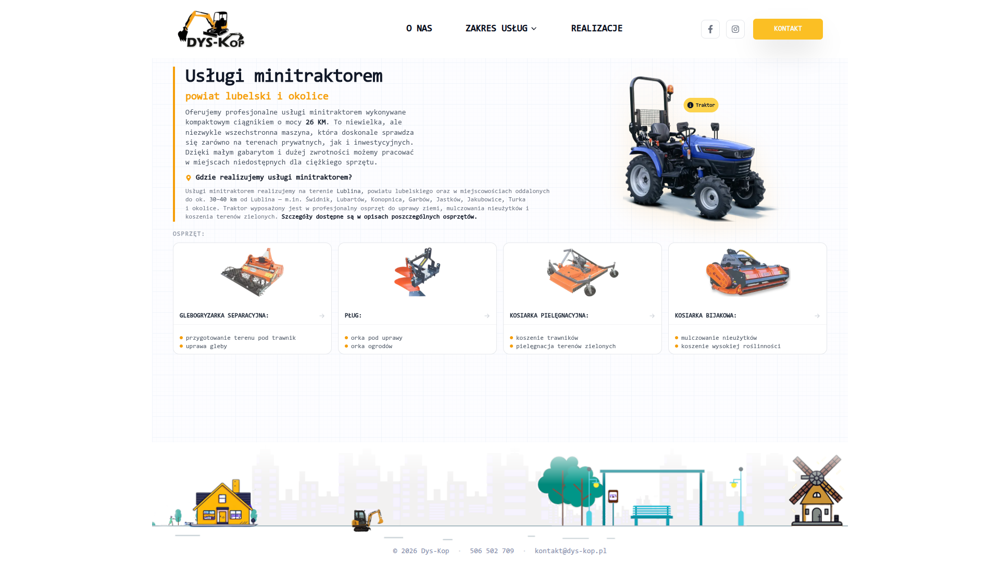
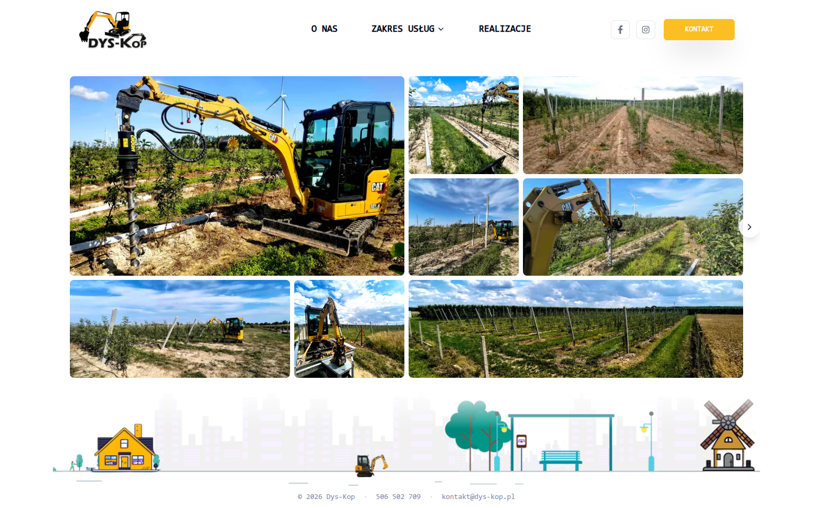
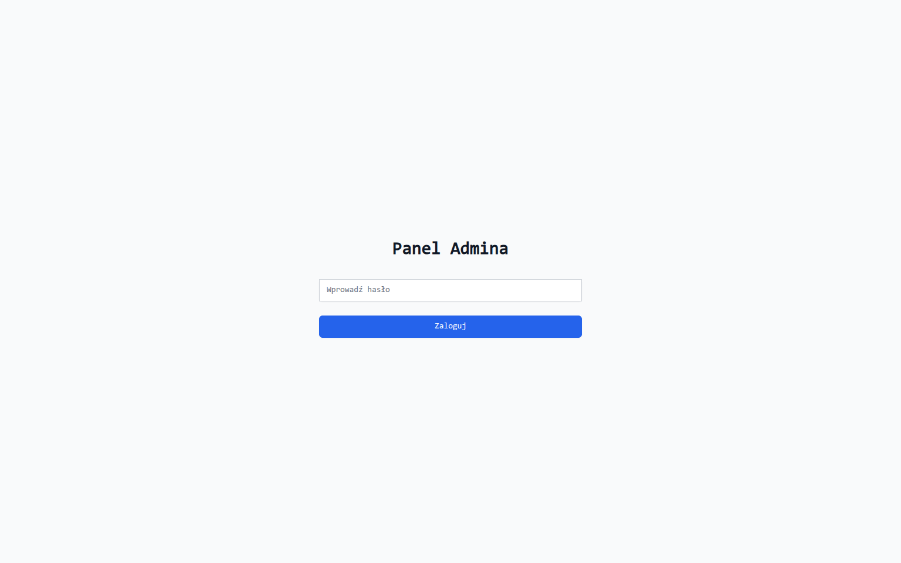
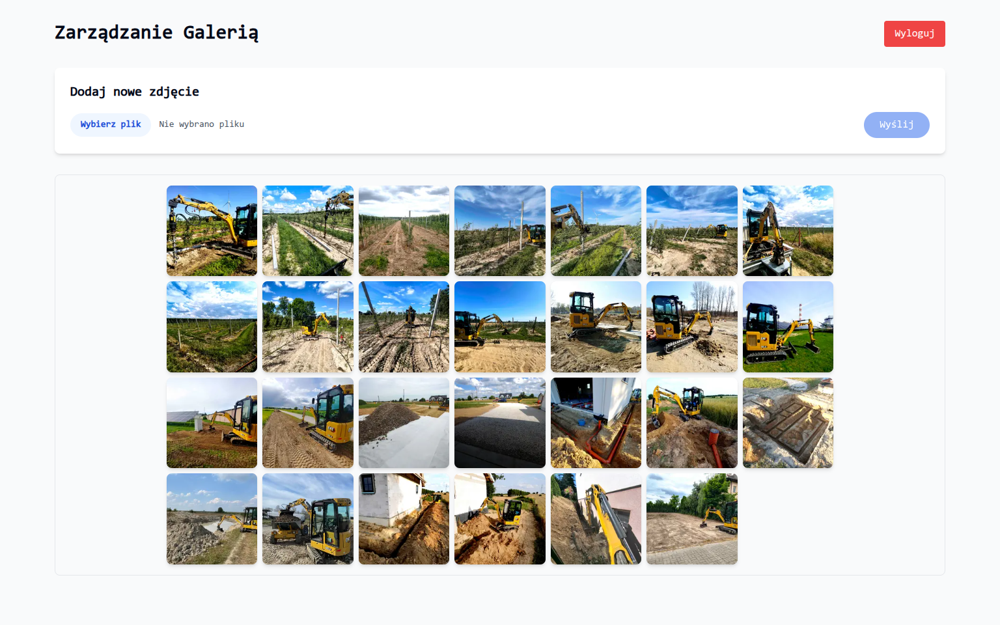

# Dys-Kop

**Business website for mini-excavator, drill & mini-tractor services in Lublin, Poland**

[**View Live Site**](https://dys-kop.pl)

---

## About

Dys-Kop is a production Next.js 14 website built for a mini-excavator services company operating in the Lublin region of Poland. The site is fully server-rendered with App Router, features a custom admin panel for gallery management via Vercel Blob storage, and is optimized for Polish-language SEO with structured data, sitemaps, and semantic HTML.

## SEO Results

SEO was a top priority for the client. The site achieves a **Lighthouse SEO score of 100** and ranks **#1 on Google** for target keywords like *"uslugi minitraktorem lubelskie"* (mini-tractor services Lublin region).

<table>
<tr>
<td width="50%">

**#1 Google Search Result**

</td>
<td width="50%">

**Lighthouse SEO: 100/100**

</td>
</tr>
</table>

## Pages

<table>
<tr>
<td width="50%">

</td>
<td width="50%">

</td>
</tr>
</table>

<table>
<tr>
<td width="50%">

</td>
<td width="50%">

</td>
</tr>
</table>

<table>
<tr>
<td>

</td>
</tr>
</table>

## Admin Panel

Password-protected dashboard for managing the photo gallery. Supports image upload to Vercel Blob storage with automatic blur placeholder generation, and single-click deletion.

<table>
<tr>
<td width="50%">

**Login**

</td>
<td width="50%">

**Gallery Management**

</td>
</tr>
</table>

## Tech Stack

